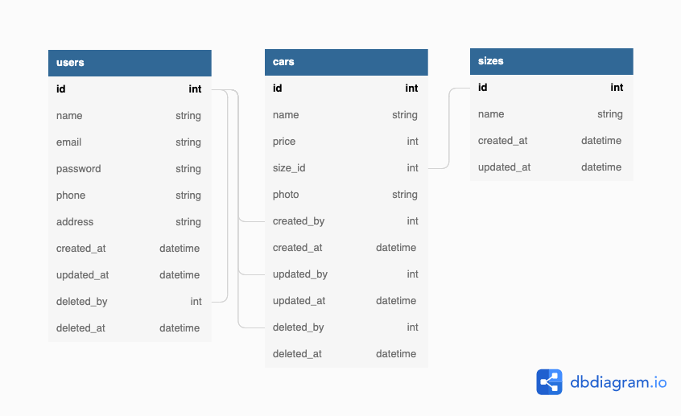

# Car Management API

## 🚀 How to run 

Berikut cara menjalankan project ini

1. Pertama, clone project ini.
2. Kedua, pastikan folder project sudah aktif pada terminal atau command line.
3. Ketiga, pastikan sequelize cli sudah terinstall secara global. Untuk instalasi sequelize, jalankan perintah `npm install -g sequelize-cli`.
4. Keempat, jalankan perintah `npm install` untuk menginstall semua package.
5. Kelima, duplicate file .env.example dengan nama .env dengan menjalankan perintah `cp .env.example .env`.
6. Selanjutnya, edit database konfigurasi `.env` baik itu nama database, user, dan password.
7. Kemudian, jalankan perintah `npm run init-db` untuk melakukan migrasi dan seeder table pada database.
8. Setelah itu, jalankan perintah `npm run dev` untuk menjalankan project ini pada browser.
9. Terakhir, buka link yang muncul pada terminal di browser Anda.
10. Happy Coding 😍

## 📡 Endpoints 
| Route              | Method   | Penggunaan                              |
| ------------------ | -------- | --------------------------------------- |
| /api/v1/login      | `POST`   | Melakukan proses login                  |
| /api/v1/register   | `POST`   | Melakukan proses register               |
| /api/v1/profile    | `GET`    | Mendapatkan data user yang sedang login |
| /api/v1/profile    | `PUT`    | Mengupdate data user yang sedang login  |
| /api/v1/cars       | `GET`    | Mendapatkan semua data car              |
| /api/v1/cars/:id   | `GET`    | Mendapatkan data car berdasar ID        |
| /api/v1/cars       | `POST`   | Menyimpan data car baru                 |
| /api/v1/cars/:id   | `PUT`    | Mengupdate data car berdasar ID         |
| /api/v1/cars/:id   | `DELETE` | Menghapus data car berdasar ID          |
| /api/v1/admins     | `GET`    | Mendapatkan semua data admin            |
| /api/v1/admins/:id | `GET`    | Mendapatkan data admin berdasar ID      |
| /api/v1/admins     | `POST`   | Menyimpan data admin baru               |
| /api/v1/admins/:id | `PUT`    | Mengupdate data admin berdasar ID       |
| /api/v1/admins/:id | `DELETE` | Menghapus data admin berdasar ID        |

## 📜 SWAGGER 
| Route              | Method   | Penggunaan                              |
| ------------------ | -------- | --------------------------------------- |
| /docs              | `GET`    | Menampilkan swagger UI                  |
| /api-docs          | `GET`    | Menampilkan swagger dalam bentuk JSON   |

## 💾 ERD 

